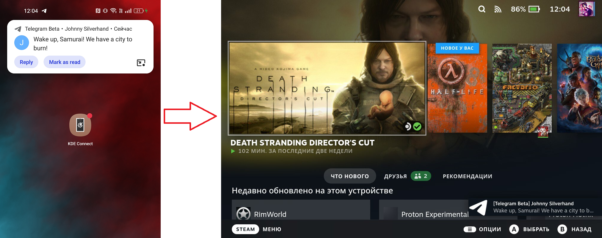
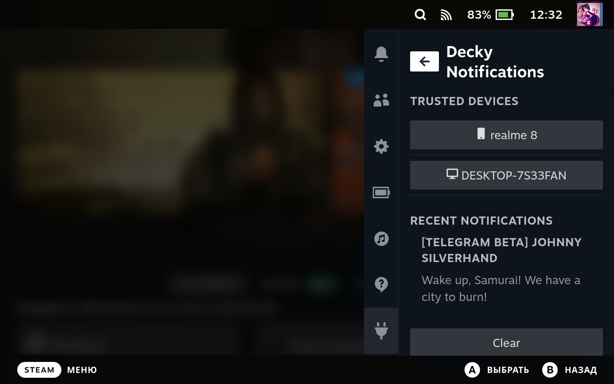

# Decky Notifications 

Get all your phone notifications instantly synced to Steam Deck. Based on [KDE Connect Protocol](https://kdeconnect.kde.org/).

**Requires [KDE Connect](https://kdeconnect.kde.org/download.html) on phone. Tested with Android and Windows.**

## Pairing

To start using KDE Connect features you need to pair your devices. Open your KDE Connect application, find Steam Deck and request pairing.

Due to lack of actions in SteamOS notifications you need click ugly `Click to accept` link inside notification to accept incoming request.
Notification will dismiss in 15 seconds. Just ignore notification in case you want to discard pairing.

## Settings 

In Decky menu you can:

- Check last notifications
- Unpair trusted devices

**NOTE:** Button `Clear` clears only Steam Deck `Recent Notifications` section. 

## Limitations

- This plugin implements only `notifcation`- and `ping`-related features. 
- KDE Connect on iOS can't access notifications. It is a restriction of iOS.
- Due to implementation details Steam Deck can't connect to another Steam Deck. 

## TODO

- [ ] Inject synced notifications to native Notifications Tab.
- [ ] Add support for notification actions and replies.